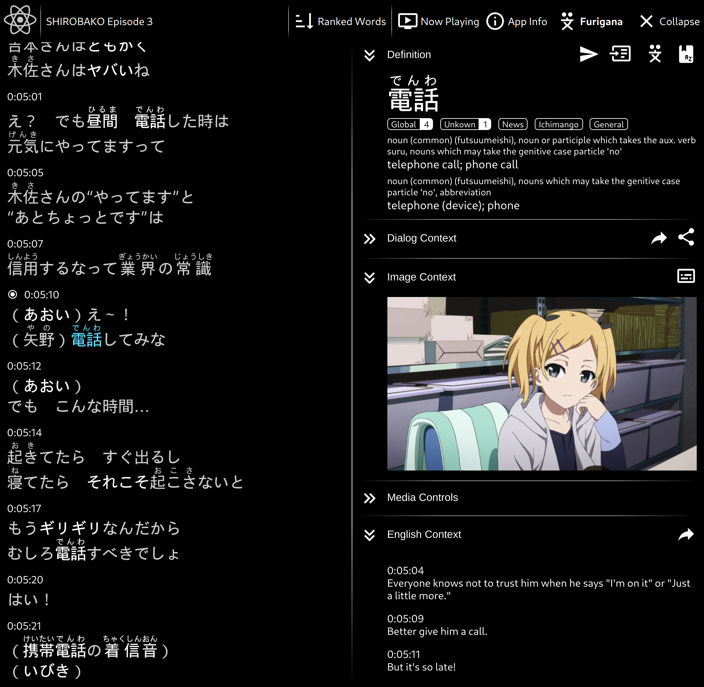

# Erabikata (選び方)

This is a program I wrote to help teach myself Japanese through anime.\
With it, I went from "not knowing a single word of Japanese" to "able to go backpacking through Japan" in _about 9 months_!

It started as a quick bash script to grep the subtitle files of various anime for examples of words I had to learn. But over time
